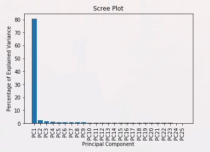
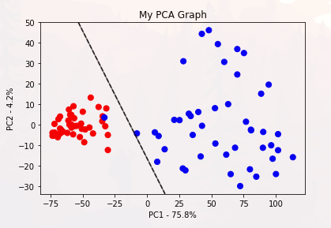

# Problem Statement

The primary goal of the project is to determine whether or not a sample of tissue is tumerous based on its methylation profile. We will also attempt to guage the age and ethnicity of the patient, but this will likely prove more difficult and will be addressed in future deliverables.

# Data preprocessing

To start we are working with 92 samples from a study titled "Genome-wide DNA methylation analysis of non-cancerous urothelium obtained from patients with urothelial carcinomas and corresponding cancerous tissue". Each of these samples has 485577 features. Initially, our preprocessing methods included replacing null values with 0.5 (because that is the average value), and using PCA dimension reduction to reduce the number of features from 485577 to 2. However, I wasn't satisfied with the way that the top two principle components combined only accounted for about 30% of the variance. Therefore I changed our preprocessing to include removing all but the 5000 statistically most significant features with respect to classifying a sample as normal or cancerous. Now the top two principle components combined account for 80% of the variance. Note: We split the 92 samples into training and test data by randomly assigning 90% of the samples to be training data, and leaving the other 10% to be test data.

# Machine Learning Model

My chosen model is dimension reduction via PCA, and classification via SVM.

We chose PCA because it proves very difficult to work with 485577 features. We then used a support vector machine to classify the samples as normal or tumorous because the graph revealed this to be a linear problem.

The model does not seem to be over or underfitting as it was able to achieve 100% accuracy in classifying the test data.

# Preliminary results

After performing PCA, 80% of the explained variance is accounted for by the first two principle components.

Overall performance of the model is very good; it classified 100% of the test data correctly.

See graphs on following pages. Red points correspond to normal tissue while blue points correspond to cancerous tissue.

# Next Steps

Combining multiple datasets would allow for a more robust test of the model to work across datasets, while also serving as a source of more training data. One approach would be to use one dataset as a training set, and a completely different training set as a test set. I have already identified a potential test set with the methylation profiles of urine from patients with and without urothelial carcinomas and corresponding cancerous tissue. I chose this dataset because the cancer types are closely related. 

Look into Deep learning as an alternative to PCA. 

Further down the road i'd like to load many more datasets and see how the models handle samples of different tumor types.

